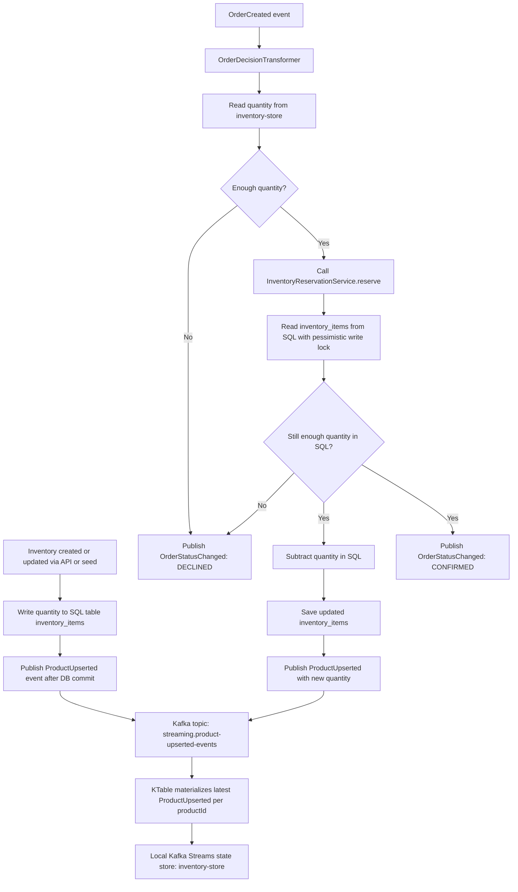

# Streaming Service Inventory State Flow

The `streaming-service` keeps inventory quantity in two places with different responsibilities:

- SQL table `inventory_items`: authoritative inventory state.
- Kafka Streams `inventory-store`: event-derived read model used by the stream processor.

SQL is the source of truth for inventory mutation. When inventory is created, updated, or reserved, the service writes the resulting quantity to `inventory_items`. During order reservation, the service rereads inventory from SQL with a pessimistic write lock before subtracting stock, so concurrent orders cannot reserve the same units.

The Kafka Streams state store is built from `streaming.product-upserted-events`. Each `ProductUpserted` event contains the latest product information and quantity. Kafka Streams materializes those events as a `KTable` into the local `inventory-store`, keyed by `productId`.

When an `OrderCreated` event arrives, the stream processor first checks `inventory-store` to decide whether the order appears fulfillable. If enough quantity is available, it calls the reservation service. The reservation service performs the real SQL update. After the SQL transaction commits, the service publishes another `ProductUpserted` event with the new quantity, which refreshes the KTable/state store.

In short: SQL owns the actual inventory quantity, while the Kafka Streams state store holds the latest event-derived copy for fast stream-time decisions.
